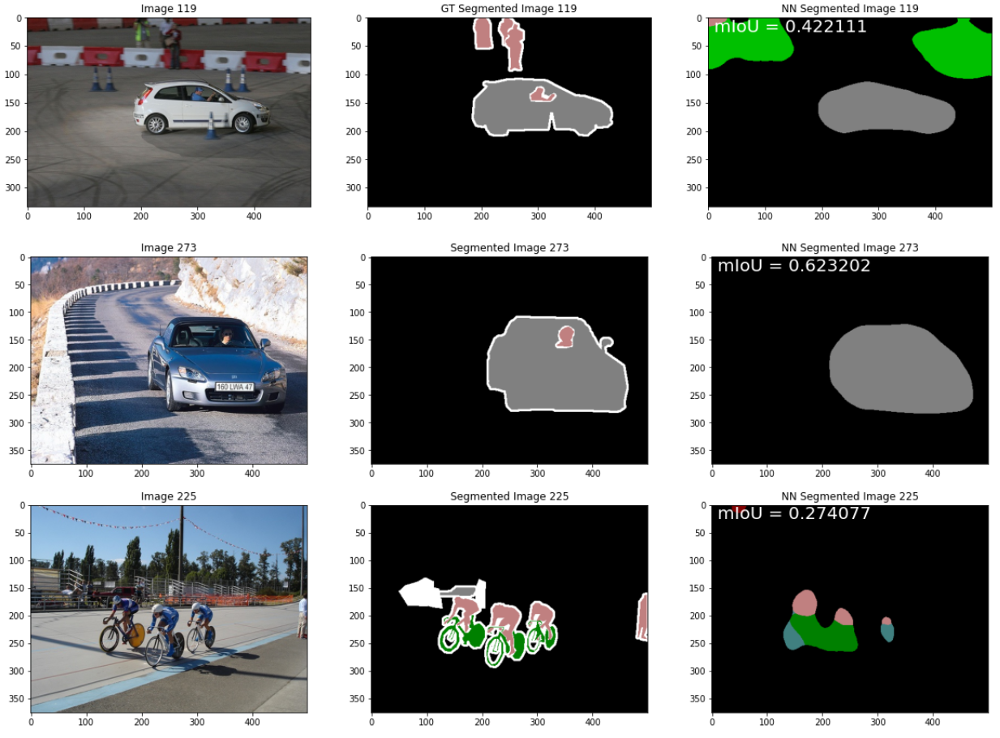

# A3_Semantic-Segmentation-CNN
This repository contains the Jupyter notebook used to create, train, and evaluate a neural network for semantic segmentation. The CNN uses a pretrained ResNet-34 model 
for the encoder and two convolutional layers for the decoder. The resulting mIoU was 65.6% for the training dataset and 42.2% for the validation dataset. 

## Result
The below image shows the resulting segmented image from the CNN for three different images.

